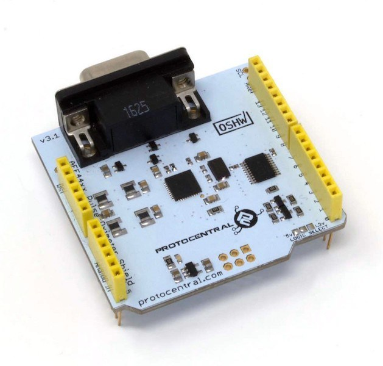
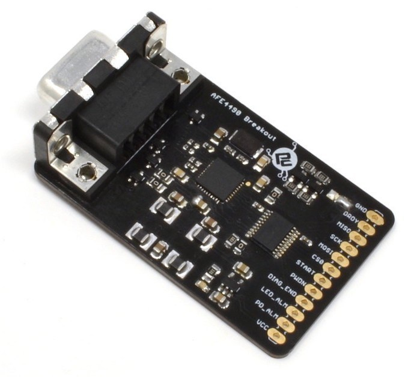

Protocentral AF4490/AFE4400 based PPG/SpO2/HR shield for Arduino
================================

## Don't have one? [Buy one here](https://protocentral.com/product/protocentral-afe4490-pulse-oximeter-breakout-board-kit/)

[  
*AFE4490 Pulse Oximeter Shield Kit for Arduino ](https://protocentral.com/product/protocentral-afe4490-pulse-oximeter-shield-for-arduino-v2/)

  

Measuring SpO2 aka Specific Oxygen levels in blood has never been so easy! With the new AFE4490 IC our shield does an amazing job of measuring heart rate as well as SpO2 values. Pulse Oximetry is an indirect method of measuring the oxygen levels in the blood. The sensor measures the amount of red and IR light wavelengths absorbed by blood to calculate the oxygen levels in blood. The measurement is done by a probe that clips on to a finger and contains emitters as well as a light sensor.

For more information on how exactly Pulse Oximetry works, check this out, here.

Since the amount of blood flowing through any blood vessel varies (pulses) with the rate of blood from the heart, this can also be used for measuring heart rate without the need for connecting any ECG electrodes.

## Hardware Setup

Connections with the Arduino board is as follows:

|AFE4490 pin label| Arduino Connection   |Pin Function                  |
|----------------- |:--------------------:|-----------------:           |
| GND              | Gnd                  |  Gnd                        |             
| DRDY             | D2                   |  Data ready(interrupt)      |
| MISO             | D12                  |  Slave out                  |
| SCK              | D13                  |  SPI clock                  |
| MOSI             | D11                  |  Slave in                   |
| CS0              | D7                   |  Slave select               |
| START            | D5                   |  Conversion start Pin       |
| PWDN             | D4                   |  Power Down/ Reset          |
| DIAG_END         | --                  |  Diagnostic output          |
| LED_ALM          | --                |  Cable fault indicator      |
| PD_ALM           | --                 |  PD sensor fault indicator  |
| VCC              | +5v                  |  Supply voltage             |

## Visualizing Output

[AFE4490 Breakout Board Documentation](https://docs.protocentral.com/getting-started-with-AFE4490/)

 

## For the main documentation site, GUI and more resources, please check out our main [GitHub Repo](https://github.com/Protocentral/AFE4490_Oximeter)

License Information
===================

This product is open source! Both, our hardware and software are open source and licensed under the following licenses:

Hardware
---------

**All hardware is released under [Creative Commons Share-alike 4.0 International](http://creativecommons.org/licenses/by-sa/4.0/).**

You are free to:

* Share — copy and redistribute the material in any medium or format
* Adapt — remix, transform, and build upon the material for any purpose, even commercially.
The licensor cannot revoke these freedoms as long as you follow the license terms.

Under the following terms:

* Attribution — You must give appropriate credit, provide a link to the license, and indicate if changes were made. You may do so in any reasonable manner, but not in any way that suggests the licensor endorses you or your use.
* ShareAlike — If you remix, transform, or build upon the material, you must distribute your contributions under the same license as the original.

Software
--------

**All software is released under the MIT License(http://opensource.org/licenses/MIT).**

THE SOFTWARE IS PROVIDED "AS IS", WITHOUT WARRANTY OF ANY KIND, EXPRESS OR IMPLIED, INCLUDING BUT NOT LIMITED TO THE WARRANTIES OF MERCHANTABILITY, FITNESS FOR A PARTICULAR PURPOSE AND NONINFRINGEMENT. IN NO EVENT SHALL THE AUTHORS OR COPYRIGHT HOLDERS BE LIABLE FOR ANY CLAIM, DAMAGES OR OTHER LIABILITY, WHETHER IN AN ACTION OF CONTRACT, TORT OR OTHERWISE, ARISING FROM, OUT OF OR IN CONNECTION WITH THE SOFTWARE OR THE USE OR OTHER DEALINGS IN THE SOFTWARE.

Please check [*LICENSE.md*](LICENSE.md) for detailed license descriptions.
