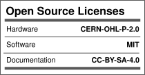

# ProtoCentral AFE4490/AFE4400 Pulse Oximeter Arduino Library

[](https://github.com/Protocentral/protocentral-afe4490-arduino/actions?workflow=Compile+Examples)

A comprehensive Arduino library for the Texas Instruments AFE4490 and AFE4400 analog front-end chips for pulse oximetry and photoplethysmography (PPG) applications. This library provides complete hardware abstraction, real-time SpO2/HR algorithms, and multi-platform support.


## Where to buy the hardware?

- **Shield**: [ProtoCentral AFE4490 Pulse Oximeter Shield](https://protocentral.com/product/protocentral-afe4490-pulse-oximeter-shield-for-arduino-v2/)
- **Breakout Board**: [ProtoCentral AFE4490 Breakout Board Kit](https://protocentral.com/product/protocentral-afe4490-pulse-oximeter-breakout-board-kit/)

## Features

### 📋 **Core Functionality**
- Real-time PPG signal acquisition
- SpO2 (blood oxygen saturation) calculation
- Heart rate detection and analysis
- Dual LED (Red/IR) timing control
- TIA gain and LED current configuration
- Interrupt-driven data acquisition
- Signal processing and filtering

## Quick Start

### 1. Hardware Setup

#### Shield Connection
Connect the AFE4490 shield by stacking it on top of your Arduino. The shield uses SPI communication and includes ICSP headers for compatibility with newer Arduino boards (Yun, Due, etc.).

#### Breakout Board Wiring

| AFE4490 Pin | Arduino Pin | Function |
|-------------|-------------|----------|
| GND | GND | Ground |
| DRDY | D2 | Data Ready (Interrupt) |
| MISO | D12 | SPI MISO |
| SCK | D13 | SPI Clock |
| MOSI | D11 | SPI MOSI |
| CS0 | D7 | Chip Select |
| START | D5 | Conversion Start |
| PWDN | D4 | Power Down/Reset |
| VCC | +5V | Supply Voltage |

### 2. Basic Usage

```cpp
#include "protocentral_afe44xx.h"

#define AFE44XX_CS_PIN   7
#define AFE44XX_PWDN_PIN 4
#define AFE44XX_DRDY_PIN 2

AFE44XX afe44xx(AFE44XX_CS_PIN, AFE44XX_PWDN_PIN, AFE44XX_DRDY_PIN);

void setup() {
    Serial.begin(115200);
    
    // Use default configuration
    AFE44xxConfig config = AFE44XX::getDefaultConfig();
    
    // Initialize the AFE44XX
    AFE44xxError error = afe44xx.begin(config);
    if (error != AFE44xxError::NONE) {
        Serial.println("Initialization failed!");
        return;
    }
    
    Serial.println("AFE44XX initialized successfully!");
}

void loop() {
    AFE44xxData data;
    AFE44xxError error = afe44xx.readData(data);
    
    if (error == AFE44xxError::NONE && data.dataValid) {
        Serial.print("IR: ");
        Serial.print(data.irData);
        Serial.print(" Red: ");
        Serial.println(data.redData);
    }
    
    delay(10);
}
```

## API Reference

### Core Classes

#### `AFE44XX`
Main class for interfacing with AFE4490/AFE4400 chips.

**Constructors:**
```cpp
// Standard constructor
AFE44XX(uint8_t csPin, uint8_t pwdnPin, uint8_t drdyPin);

// Constructor with custom SPI pins
AFE44XX(uint8_t csPin, uint8_t pwdnPin, uint8_t drdyPin, 
        int8_t sckPin, int8_t misoPin, int8_t mosiPin);

// Constructor with SPI configuration struct
AFE44XX(uint8_t csPin, uint8_t pwdnPin, uint8_t drdyPin, 
        const AFE44xxSPIConfig& spiConfig);
```

**Primary Methods:**
```cpp
// Initialize the AFE44XX with configuration
AFE44xxError begin(const AFE44xxConfig& config);

// Read sensor data
AFE44xxError readData(AFE44xxData& data);

// Perform hardware self-test
AFE44xxError performSelfTest();

// Get current configuration
void getConfig(AFE44xxConfig& config);

// Update configuration
AFE44xxError updateConfig(const AFE44xxConfig& config);

// Configure custom SPI pins
AFE44xxError setSPIPins(int8_t sckPin, int8_t misoPin, int8_t mosiPin);

// Get error description
const char* getErrorString(AFE44xxError error);
```

**Static Configuration Methods:**
```cpp
// Get default configuration
static AFE44xxConfig getDefaultConfig();

// Get default configuration with custom SPI
static AFE44xxConfig getDefaultConfigWithSPI(const AFE44xxSPIConfig& spiConfig);
static AFE44xxConfig getDefaultConfigWithSPI(int8_t sckPin, int8_t misoPin, int8_t mosiPin);
```

### Configuration Structures

#### `AFE44xxConfig`
```cpp
struct AFE44xxConfig {
    AFE44xxChipType chipType;           // AFE4490 or AFE4400
    LEDCurrent led1Current;             // Red LED current
    LEDCurrent led2Current;             // IR LED current  
    TIAGain tiaGain;                    // Transimpedance amplifier gain
    SampleRate sampleRate;              // Sampling rate
    uint8_t averagingFactor;            // Signal averaging (1-16)
    bool enableDiagnostics;             // Enable hardware diagnostics
    AFE44xxSPIConfig spiConfig;         // SPI configuration
};
```

#### `AFE44xxData`
```cpp
struct AFE44xxData {
    uint32_t irData;                    // IR LED measurement
    uint32_t redData;                   // Red LED measurement
    uint32_t timestamp;                 // Measurement timestamp
    bool dataValid;                     // Data validity flag
    AFE44xxError lastError;             // Last error status
};
```

### Enumerations

#### `AFE44xxError`
```cpp
enum class AFE44xxError {
    NONE,                               // No error
    SPI_ERROR,                          // SPI communication error
    CHIP_NOT_RESPONDING,                // Chip not responding
    INVALID_CONFIG,                     // Invalid configuration
    SELF_TEST_FAILED,                   // Self-test failure
    TIMEOUT                             // Operation timeout
};
```

#### `LEDCurrent`
```cpp
enum class LEDCurrent {
    CURRENT_0MA,    CURRENT_25MA,   CURRENT_50MA,   CURRENT_75MA,
    CURRENT_100MA   // Available current settings
};
```

#### `TIAGain`
```cpp
enum class TIAGain {
    GAIN_500K,      GAIN_250K,      GAIN_100K,      GAIN_50K,
    GAIN_25K,       GAIN_10K        // Available TIA gains
};
```

#### `SampleRate`
```cpp
enum class SampleRate {
    RATE_50HZ,      RATE_100HZ,     RATE_200HZ,     RATE_500HZ,
    RATE_800HZ,     RATE_1000HZ     // Available sample rates
};
```

### Platform-Specific SPI Configuration

#### Default SPI Pins by Platform

| Platform | SCK | MISO | MOSI |
|----------|-----|------|------|
| ESP32-S3 | 12  | 13   | 11   |
| ESP32-S2 | 36  | 37   | 35   |
| ESP32-C3 | 6   | 5    | 7    |
| ESP32    | 18  | 19   | 23   |
| ESP8266  | 14  | 12   | 13   |
| Arduino  | 13  | 12   | 11   |

#### Custom SPI Examples

```cpp
// ESP32 with custom pins
AFE44XX afe44xx(7, 4, 2, 18, 19, 23);

// ESP32-S3 with custom pins  
AFE44XX afe44xx(7, 4, 2, 12, 13, 11);

// Runtime SPI configuration
afe44xx.setSPIPins(18, 19, 23);
```

## Algorithm Integration

### SpO2 and Heart Rate Calculation

The library includes integrated algorithms for real-time physiological parameter calculation:

```cpp
#include "protocentral_afe44xx.h"
#include "Protocentral_spo2_algorithm.h"
#include "protocentral_hr_algorithm.h"

spo2_algorithm spo2Calc;
hr_algo hrCalc;

// In your loop function
uint16_t irBuffer[100];
uint16_t redBuffer[100];
int32_t heartRate, spo2;
int8_t validHR, validSpO2;

// Calculate SpO2 and heart rate
spo2Calc.estimate_spo2(irBuffer, 100, redBuffer, &spo2, &validSpO2, &heartRate, &validHR);

if (validSpO2) {
    Serial.print("SpO2: ");
    Serial.print(spo2);
    Serial.println("%");
}

if (validHR) {
    Serial.print("Heart Rate: ");
    Serial.print(heartRate);
    Serial.println(" BPM");
}
```

## Examples

The library includes comprehensive examples demonstrating all features:

### Example 1: Raw PPG Plot (OpenView)
**File:** `Example-1-Raw-PPG-plot-openview.ino`

Basic PPG signal acquisition and visualization with ProtoCentral OpenView software.

**Features:**
- Raw IR and Red LED data acquisition
- Real-time data streaming
- OpenView protocol implementation
- Basic error handling

**Use Case:** Data visualization and signal quality assessment

### Example 2: Computed SpO2
**File:** `Example-2-computed-spo2.ino`

Real-time SpO2 and heart rate calculation using integrated algorithms.

**Features:**
- SpO2 calculation with validation
- Heart rate detection
- Data buffering and processing
- Algorithm parameter tuning

**Use Case:** Complete pulse oximetry implementation

### Example 3: Arduino Plotter Integration
**File:** `Example-3-Raw-PPG-plot-Arduino-Plotter.ino`

PPG signal visualization using Arduino IDE's built-in serial plotter.

**Features:**
- Formatted output for Arduino plotter
- Real-time waveform display
- Signal conditioning
- Multi-channel plotting

**Use Case:** Development and debugging with Arduino IDE

### Example 4: Advanced Features
**File:** `Example-4-Advanced-Features.ino`

Comprehensive demonstration of all library capabilities.

**Features:**
- Complete configuration options
- Error handling and diagnostics
- Self-test procedures
- Hardware monitoring
- Performance optimization

**Use Case:** Production-ready implementation template

### Example 5: Custom SPI Pins
**File:** `Example-5-Custom-SPI-Pins.ino`

Multi-platform SPI configuration demonstration.

**Features:**
- Platform-specific pin configuration
- Runtime SPI setup
- Custom hardware interfacing
- Error recovery mechanisms

**Use Case:** Non-standard hardware configurations

### Example 6: ESP32-S3 Specific
**File:** `Example-6-ESP32S3-Specific.ino`

ESP32-S3 platform-specific implementation.

**Features:**
- ESP32-S3 optimizations
- Platform-specific features
- Power management
- WiFi integration capabilities

**Use Case:** ESP32-S3 development projects

## Advanced Configuration

### Custom Configuration Example

```cpp
AFE44xxConfig config;
config.chipType = AFE44xxChipType::AFE4490;
config.led1Current = LEDCurrent::CURRENT_75MA;
config.led2Current = LEDCurrent::CURRENT_75MA;
config.tiaGain = TIAGain::GAIN_500K;
config.sampleRate = SampleRate::RATE_500HZ;
config.averagingFactor = 4;
config.enableDiagnostics = true;

// Platform-specific SPI configuration
config.spiConfig.sckPin = 18;
config.spiConfig.misoPin = 19;
config.spiConfig.mosiPin = 23;
config.spiConfig.useHardwareSPI = true;

AFE44xxError error = afe44xx.begin(config);
```

### Error Handling Best Practices

```cpp
AFE44xxError error = afe44xx.readData(data);

switch (error) {
    case AFE44xxError::NONE:
        // Process valid data
        break;
    case AFE44xxError::SPI_ERROR:
        Serial.println("SPI communication error - check connections");
        break;
    case AFE44xxError::CHIP_NOT_RESPONDING:
        Serial.println("AFE44XX not responding - check power and wiring");
        break;
    case AFE44xxError::TIMEOUT:
        Serial.println("Operation timeout - retry");
        break;
    default:
        Serial.print("Unknown error: ");
        Serial.println(afe44xx.getErrorString(error));
        break;
}
```

## Performance Optimization

### Tips for Best Performance

1. **Sample Rate Selection:** Choose appropriate sample rate for your application
   - SpO2: 100-500 Hz recommended
   - Heart Rate: 50-200 Hz sufficient
   - Signal Analysis: 500-1000 Hz

2. **LED Current Optimization:** Balance between signal quality and power consumption
   - Start with 50mA for both LEDs
   - Adjust based on sensor coupling and ambient light

3. **TIA Gain Configuration:** Match gain to expected signal levels
   - High gain (500K) for weak signals
   - Lower gain (100K-250K) for strong signals

4. **Averaging:** Use averaging to improve SNR
   - Factor of 2-4 for real-time applications
   - Higher factors for static measurements

## Troubleshooting

### Common Issues

| Issue | Possible Cause | Solution |
|-------|---------------|----------|
| No data readings | Wiring problem | Check SPI connections |
| Erratic readings | Poor sensor contact | Ensure proper finger placement |
| Initialization fails | Power/reset issue | Check PWDN pin connection |
| Low signal quality | Ambient light | Shield sensor from light |
| High noise | Improper grounding | Ensure good ground connections |

### Diagnostic Tools

```cpp
// Perform self-test
AFE44xxError error = afe44xx.performSelfTest();
if (error != AFE44xxError::NONE) {
    Serial.print("Self-test failed: ");
    Serial.println(afe44xx.getErrorString(error));
}

// Get configuration
AFE44xxConfig config;
afe44xx.getConfig(config);
Serial.print("Current sample rate: ");
Serial.println(static_cast<int>(config.sampleRate));
```

# Visualization


For detailed visualization setup, refer to the [AFE4490 Documentation](https://docs.protocentral.com/getting-started-with-AFE4490/).

## Contributing

We welcome contributions to improve this library! Please:

1. Fork the repository
2. Create a feature branch
3. Add tests for new functionality
4. Update documentation
5. Submit a pull request

### Development Guidelines

- Follow Arduino library conventions
- Maintain compatibility with existing examples
- Add platform-specific testing where applicable
- Update this README for new features

## Support

- **Documentation:** [AFE4490 Documentation](https://docs.protocentral.com/getting-started-with-AFE4490/)
- **Hardware:** [ProtoCentral Store](https://protocentral.com/)
- **Issues:** [GitHub Issues](https://github.com/Protocentral/protocentral-afe4490-arduino/issues)
- **Discussions:** [GitHub Discussions](https://github.com/Protocentral/protocentral-afe4490-arduino/discussions)

## Version History

### v2.0.0
- Complete library rewrite with modern C++ API
- Robust error handling
- Type-safe enumerations
- Improved algorithm integration

### v1.x
- Basic AFE4490 support
- Simple data acquisition
- Legacy API compatibility

---

License Information
===================



This product is open source! Both, our hardware and software are open source and licensed under the following licenses:

Hardware
---------

**All hardware is released under the [CERN-OHL-P v2](https://ohwr.org/cern_ohl_p_v2.txt)** license.

Copyright CERN 2020.

This source describes Open Hardware and is licensed under the CERN-OHL-P v2.

You may redistribute and modify this documentation and make products
using it under the terms of the CERN-OHL-P v2 (https:/cern.ch/cern-ohl).
This documentation is distributed WITHOUT ANY EXPRESS OR IMPLIED
WARRANTY, INCLUDING OF MERCHANTABILITY, SATISFACTORY QUALITY
AND FITNESS FOR A PARTICULAR PURPOSE. Please see the CERN-OHL-P v2
for applicable conditions

Software
--------

**All software is released under the MIT License(http://opensource.org/licenses/MIT).**

THE SOFTWARE IS PROVIDED "AS IS", WITHOUT WARRANTY OF ANY KIND, EXPRESS OR IMPLIED, INCLUDING BUT NOT LIMITED TO THE WARRANTIES OF MERCHANTABILITY, FITNESS FOR A PARTICULAR PURPOSE AND NONINFRINGEMENT. IN NO EVENT SHALL THE AUTHORS OR COPYRIGHT HOLDERS BE LIABLE FOR ANY CLAIM, DAMAGES OR OTHER LIABILITY, WHETHER IN AN ACTION OF CONTRACT, TORT OR OTHERWISE, ARISING FROM, OUT OF OR IN CONNECTION WITH THE SOFTWARE OR THE USE OR OTHER DEALINGS IN THE SOFTWARE.

Documentation
-------------
**All documentation is released under [Creative Commons Share-alike 4.0 International](http://creativecommons.org/licenses/by-sa/4.0/).**


You are free to:

* Share — copy and redistribute the material in any medium or format
* Adapt — remix, transform, and build upon the material for any purpose, even commercially.
The licensor cannot revoke these freedoms as long as you follow the license terms.

Under the following terms:

* Attribution — You must give appropriate credit, provide a link to the license, and indicate if changes were made. You may do so in any reasonable manner, but not in any way that suggests the licensor endorses you or your use.
* ShareAlike — If you remix, transform, or build upon the material, you must distribute your contributions under the same license as the original.

Please check [*LICENSE.md*](LICENSE.md) for detailed license descriptions.
